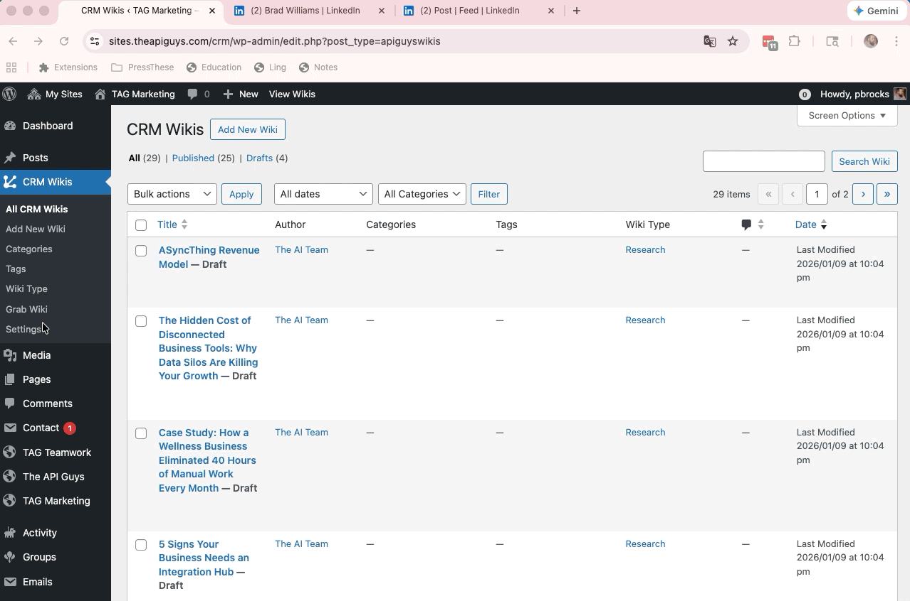

# Zsoogi Clipper

A modern WordPress plugin for creating and managing wiki-style documentation with a jQuery-free bookmarklet for quick content capture from external sources.

## Description

Zsoogi Clipper enables administrators to create, organize, and manage wiki articles within WordPress. The plugin combines a custom post type for wikis with a modern bookmarklet, allowing you to easily capture and curate content from anywhere on the web.

Perfect for teams building internal documentation, knowledge bases, API documentation, or any content that benefits from wiki-style organization and quick content capture from external sources.



## Features

### 📚 Zsoogi Management
- **Custom Post Type**: Dedicated wiki post type optimized for documentation
- **Hierarchical Taxonomy**: Organize wikis by type/category
- **Full Editor Support**: Gutenberg block editor, classic editor, thumbnails, comments, and revisions
- **REST API Ready**: Fully compatible with WordPress REST API

### 🔖 Zsoogi Clipper Bookmarklet
- **Modern JavaScript**: Pure vanilla JS with no jQuery dependency
- **YouTube Integration**: Smart title cleanup and high-quality thumbnail capture
  - Removes view counts: `(153) Video Title` → `Video Title`
  - Removes YouTube suffix: `Video Title - YouTube` → `Video Title`
  - Fetches max resolution thumbnails from YouTube API
- **Customizable Formatting**: Multiple citation format options (simple, detailed, academic)
- **Media Capture**: Automatically extract and set featured images
- **Quick Publishing**: Create wiki articles directly from web content
- **Gutenberg Blocks**: Pre-formatted content with blockquotes and citations

### 🎛️ Admin Settings
- **Settings Page**: Dedicated settings under the wiki menu
- **Citation Formats**: Choose your preferred citation style
- **Auto Featured Images**: Automatically set captured images as featured
- **Metadata Options**: Include capture date and metadata in posts

### 🎨 User Experience
- **Clean Interface**: WordPress-native admin experience
- **Intuitive Navigation**: Settings and wikis organized in one menu
- **Administrator-Only**: Secure access restricted to admin users
- **Cross-Browser Compatible**: Works in all modern browsers

## Requirements

- **WordPress**: 5.0 or higher
- **PHP**: 7.4 or higher
- **User Role**: Administrator access required
- **Composer**: Optional, for development dependencies

## Installation

### Manual Installation

1. Download the plugin files
2. Upload the `zsoogi-clipper` directory to `/wp-content/plugins/`
3. Activate the plugin through the 'Plugins' menu in WordPress
4. Navigate to the wiki settings to configure

### Composer Installation (Optional)

If using Composer dependencies for development:

```bash
cd wp-content/plugins/zsoogi-clipper
composer install
```

## Usage

### Creating a Zsoogi Article

1. Go to your WordPress admin and click **Add New Zsoogi**
2. Enter your wiki title and content
3. Assign a wiki type/category
4. Add a featured image (optional)
5. Publish your wiki article

### Using the Zsoogi Clipper Bookmarklet

1. Install the bookmarklet from the plugin settings page
2. Visit any webpage you want to capture content from
3. Click the Zsoogi Clipper bookmarklet in your browser
4. Selected text, images, and metadata are automatically captured
5. Review and publish as a wiki article

### Organizing Zsoogi Clips

- **By Type**: Use the wiki type taxonomy to categorize your content
- **Archives**: Access all wikis via the archive page
- **Search**: Zsoogi Clips are fully searchable within WordPress

## Configuration

### Settings Options

Navigate to the wiki settings page:

- **Citation Format**: Choose between simple, detailed, or academic citation styles
- **Auto-Set Featured Image**: Automatically use captured images as featured images
- **Include Page Metadata**: Add capture date and metadata to posts

## Technical Details

### Post Type
- **Slug**: `zsoogiclips`
- **Supports**: Title, Editor, Thumbnail, Comments, Revisions
- **Archive**: Available at `/zsoogiclips/`
- **Hierarchical**: No
- **Public**: Yes
- **REST API**: Enabled

### Taxonomy
- **Slug**: `zsoogi_type`
- **Hierarchical**: Yes (like categories)
- **Public**: Yes
- **REST API**: Enabled

### File Structure

```
zsoogi-clipper/
├── zsoogi-clipper.php             # Main plugin file
├── includes/
│   ├── class-zsoogi-clips.php  # CPT/Taxonomy registration
│   ├── class-admin-menu.php     # Settings page
│   └── class-zsoogi-clipper.php   # Bookmarklet handler
├── bookmarklet.html             # Bookmarklet installation guide
└── README.md
```

## Hooks & Filters

The plugin is built with WordPress best practices and provides several hooks for developers:

### Actions
- `init` - Post type and taxonomy registration
- `admin_menu` - Admin menu registration
- `admin_init` - Settings registration

### Filters
- `default_title` - Customize default post titles from bookmarklet
- `default_content` - Customize default post content formatting

## Developer Notes

### Code Standards
- Follows WordPress Coding Standards
- Comprehensive PHPDoc/JSDoc documentation
- Object-oriented architecture
- Namespaced classes (`Zsoogi\`)

### Constants
```php
ZSOOGI_CLIPS_VERSION      // Plugin version
ZSOOGI_CLIPS_PLUGIN_FILE  // Main plugin file path
ZSOOGI_CLIPS_PLUGIN_DIR   // Plugin directory path
ZSOOGI_CLIPS_PLUGIN_URL   // Plugin URL
```

## Changelog

### Version 2.4.0
- **YouTube Integration**: Smart title cleanup for YouTube videos
  - Automatically removes view count prefix (e.g., `(153)`)
  - Removes "- YouTube" suffix from titles
  - Fetches high-quality thumbnails using YouTube API
- Enhanced image capture with YouTube-specific handling
- Improved title sanitization across all URLs

### Version 2.2.0
- Renamed plugin to Zsoogi Clipper
- Replaced Press This with modern jQuery-free bookmarklet
- Added customizable citation formats (simple, detailed, academic)
- Added auto-set featured image functionality
- Added metadata capture options
- Improved Gutenberg block formatting

### Version 2.1.4
- Added Zsoogi Clipper bookmarklet functionality
- Removed legacy Press This dependencies

### Version 2.1.1
- Restructured plugin architecture with OOP approach
- Added comprehensive documentation and docblocks
- Created dedicated Admin Menu class with settings page
- Improved security and capability checks

## Support

For issues, questions, or contributions:
- **GitHub**: [https://github.com/pbrocks/zsoogi-clipper](https://github.com/pbrocks/zsoogi-clipper)
- **Author**: pbrocks

## License

This plugin is licensed under GPL v3 or later.

```
Zsoogi Clipper
Copyright (C) 2024-2025 pbrocks

This program is free software: you can redistribute it and/or modify
it under the terms of the GNU General Public License as published by
the Free Software Foundation, either version 3 of the License, or
(at your option) any later version.

This program is distributed in the hope that it will be useful,
but WITHOUT ANY WARRANTY; without even the implied warranty of
MERCHANTABILITY or FITNESS FOR A PARTICULAR PURPOSE. See the
GNU General Public License for more details.
```

## Credits

- Inspired by WordPress Press This functionality
- Built with modern vanilla JavaScript

## Branches

### Main Branch (v2.4.0)
The main branch contains the stable release with YouTube title cleanup and thumbnail integration. This version works uniformly across all URLs without platform-specific complexity.

### ProVersion Branch (v2.4.3)
An advanced version with full YouTube transcript capture functionality. This includes:
- Automatic transcript scraping from YouTube pages
- Full transcript storage in post metadata
- Transcript excerpts in post content
- Advanced settings for transcript handling

For technical details on the ProVersion implementation, see [GitHub Issue #5](https://github.com/pbrocks/zsoogi-clipper/issues/5).

## Contributing

Contributions are welcome! Please feel free to submit pull requests or open issues on GitHub.

### Development Setup

1. Clone the repository
2. Run `composer install` (if using Composer)
3. Make your changes
4. Test thoroughly
5. Submit a pull request

---

**Made with ❤️ for better documentation management in WordPress**
